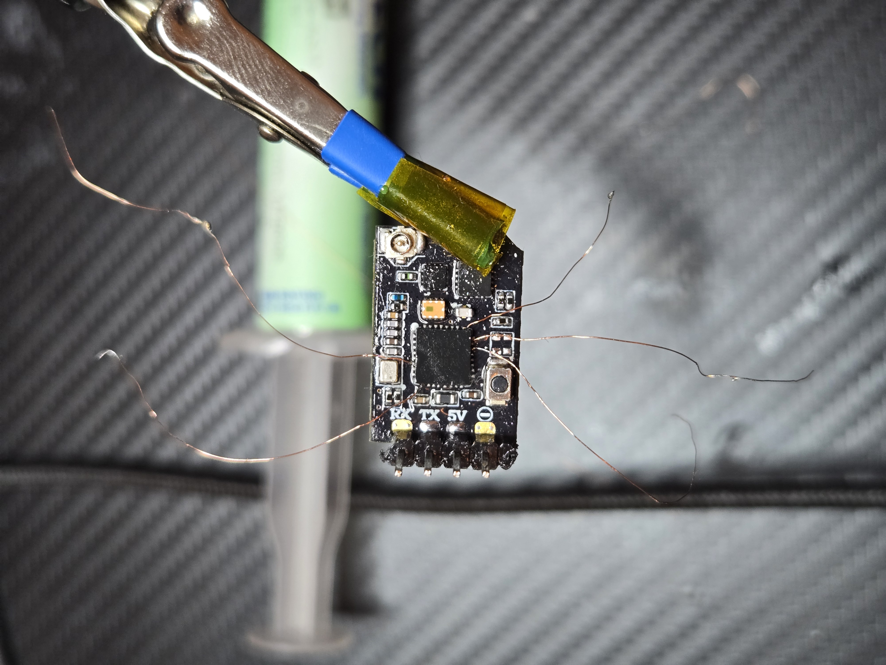
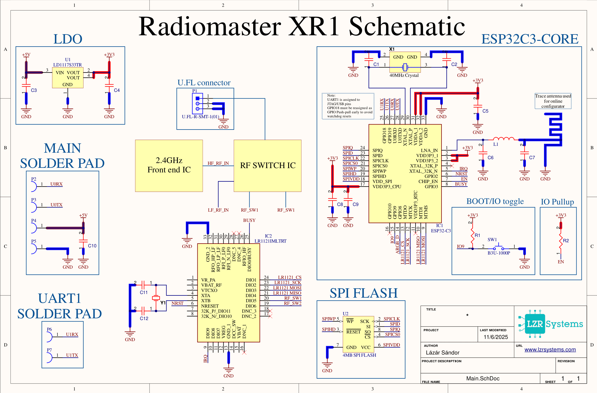

&nbsp; &nbsp; &nbsp; &nbsp; &nbsp; &nbsp; &nbsp; &nbsp; &nbsp; &nbsp; &nbsp; &nbsp; &nbsp; &nbsp; &nbsp; &nbsp; 
&nbsp;&nbsp;&nbsp;&nbsp;&nbsp;&nbsp;&nbsp;&nbsp;&nbsp;&nbsp;&nbsp;&nbsp;&nbsp;&nbsp;&nbsp;&nbsp;&nbsp;

&nbsp;&nbsp;&nbsp;&nbsp;&nbsp;&nbsp;&nbsp;&nbsp;&nbsp;&nbsp;&nbsp;&nbsp;&nbsp;&nbsp;&nbsp;&nbsp;&nbsp;
<br>
<br>
# Formula Student Telemetry System

## Table of Contents

1. [Introduction](#introduction)
2. [LoRa Introduction](#lora-introduction)
3. [Hardware](#hardware)
   - [Schematic](#schematic)
   - [Pinout](#pinout)
4. [Software](#software)
   - [RX Block Diagram](#rx-block-diagram)
   - [TX Block Diagram](#tx-block-diagram)
   - [Python Block Diagram](#python-block-diagram)
   - [HTML Block Diagram](#html-block-diagram)
   - [Communication Protocol](#communication-protocol)
     - [Packet Structure](#packet-structure)
     - [Framing](#framing)
     - [Telemetry Struct Definition](#telemetry-struct-definition)
     - [Checksum Calculation](#checksum-calculation)
   - [Frontend UI Demo Pictures](#frontend-ui-demo-pictures)
5. [How to Run](#how-to-run)
   - [Hardware Setup](#hardware-setup)
   - [Flashing Firmware](#flashing-firmware)
   - [Running Python Backend](#running-python-backend)
   - [Accessing Dashboard](#accessing-dashboard)
6. [Dependencies](#dependencies)
   - [Arduino Libraries](#arduino-libraries)
   - [Python Packages](#python-packages)
   - [Frontend Libraries](#frontend-libraries)
7. [Performance Metrics](#performance-metrics)
   - [Range Testing Results](#range-testing-results)
   - [Packet Rate & Latency](#packet-rate--latency)
   - [Signal Quality](#signal-quality)
8. [Future Improvements](#future-improvements)

---

## Introduction

&nbsp;&nbsp;&nbsp;&nbsp;&nbsp;RaceLink is a real-time telemetry system designed by the Obuda University Racing Team. The system wirelessly transmits critical vehicle data from the car to trackside monitoring stations, enabling the pit crew to monitor engine performance, GPS positioning and vehicle dynamics.

&nbsp;&nbsp;&nbsp;&nbsp;&nbsp;The system achieves reliable long-range communication (1+ km) at 25Hz update rates using LoRa technology operating at 868MHz. Data is visualized through a responsive web dashboard featuring real-time charts, live GPS tracking, and customizable widgets.

**Key Capabilities:**
- Real-time transmission of telemetry parameters at variable packet rate
- Long-range communication thanks to the LoRa modulation's link budget
- Live GPS tracking with Google Maps integration
- Customizable dashboard with draggable widgets
- Binary packet protocol with CRC error checking

**System Components:**
- **TX/RX Unit**: Radiomaster XR1 with ESP32-C3 + LR1121
- **Backend**: Python Flask server with SocketIO for real-time data streaming
- **Frontend**: Web-based dashboard with Chart.js visualization and Leaflet maps

## LoRa Introduction

## LoRa Introduction

&nbsp;&nbsp;&nbsp;&nbsp;&nbsp;**LoRa (Long Range)** is a low-power, long-range wireless communication protocol ideal for telemetry applications. Unlike traditional WiFi or Bluetooth, LoRa excels at maintaining reliable connections over distances of several kilometers, even in challenging RF environments with obstacles.

### Why LoRa for Formula Student?

Traditional wireless solutions (WiFi, Bluetooth, 2.4GHz) struggle in racing environments due to:
- Limited range (typically <100m for reliable connection)
- Poor obstacle penetration (buildings, terrain, vehicles)
- Interference from other 2.4GHz devices

LoRa at 868MHz provides:
- **Extended Range**: 1+ km with clear line of sight
- **Superior Penetration**: Sub-GHz frequencies penetrate obstacles better than 2.4GHz
- **Reliability**: Chirp Spread Spectrum modulation provides excellent noise immunity
- **Low Latency**: 100Hz 10ms Round trip Packet time achievable

### RaceLink LoRa Configuration

The current configuration of our system:
- **Frequency**: 868.5 MHz (ISM band, license-free in Europe)
- **Spreading Factor**: SF7 (balance between range and data rate)
- **Bandwidth**: 250 kHz
- **Coding Rate**: 4/6
- **TX Power**: +22 dBm (158 mW)
- **Payload Size**: 34 bytes (23 telemetry fields)

This configuration achieves:
- ~25 packets/second transmission rate
- ~40ms latency per packet
- Excellent signal quality even at 1.1km distance
- Reliable operation even with no clear line of sight

## Hardware


#### Schematic created by tracing the PCB connections of the Radiomaster XR1

### Schematic


### Pinout


## Software

### RX Block Diagram


### TX Block Diagram


### Python Block Diagram


### HTML Block Diagram


### Communication Protocol

#### Packet Structure

RaceLink uses a robust binary protocol for efficient, reliable data transmission between the TX (car) and RX (pit station) units.

**Complete Packet Format:**
```
[SYNC1][SYNC2][SIZE][DATA...][CHECKSUM]
```

| Field | Size | Value | Description |
|-------|------|-------|-------------|
| SYNC1 | 1 byte | 0xAA | First sync byte |
| SYNC2 | 1 byte | 0x55 | Second sync byte |
| SIZE | 1 byte | 31 (0x1F) | Payload size in bytes |
| DATA | 31 bytes | Telemetry struct | Binary telemetry data |
| CHECKSUM | 1 byte | XOR of DATA | Error detection |

**Total packet size:** 34 bytes (2 sync + 1 size + 31 data + 1 checksum)

#### Framing

The framing protocol ensures reliable packet synchronization in the serial data stream:

1. **Sync Bytes (0xAA 0x55)**: The receiver continuously scans the incoming byte stream looking for this unique two-byte pattern
2. **Size Byte**: Validates expected packet length (must be 31 bytes)
3. **Data Payload**: Fixed-size binary struct containing all telemetry fields
4. **Checksum**: XOR of all data bytes for error detection

**Synchronization Process:**
```
1. Scan incoming bytes for 0xAA
2. Check if next byte is 0x55
3. If yes, read size byte
4. Validate size == 31
5. Read 31 bytes of data
6. Read checksum byte
7. Verify checksum matches calculated XOR
8. If valid, parse telemetry; if not, resync
```

This framing method provides:
- Rapid resynchronization after packet loss
- Detection of corrupted packets
- No ambiguity in packet boundaries

#### Telemetry Struct Definition

The telemetry data is transmitted as a tightly-packed binary structure (31 bytes total):

```c
#pragma pack(1)  // Disable padding
struct telemetryPkt {
    uint8_t  agt;           // Air intake temperature (°C)
    int8_t   lambda;        // Lambda value (×10, e.g., 10 = 1.0λ)
    uint8_t  sebesseg;      // Speed (km/h)
    uint16_t feszultseg;    // Battery voltage (mV)
    uint16_t egt;           // Exhaust gas temperature (°C)
    uint8_t  fokozat;       // Gear (0=N, 1-6)
    uint8_t  olajny;        // Oil pressure (bar)
    uint8_t  olajh;         // Oil temperature (°C)
    uint8_t  uzemanyagny;   // Fuel level (%)
    int8_t   gyorsulas;     // Acceleration (×10, e.g., 15 = 1.5g)
    uint8_t  vizho;         // Water temperature (°C)
    uint8_t  aps;           // Throttle position (%)
    uint8_t  feknyomas;     // Brake pressure (bar)
    bool     upshift;       // Upshift button state
    bool     downshift;     // Downshift button state
    uint8_t  GPSSpeed;      // GPS speed (km/h)
    uint8_t  GPSSats;       // GPS satellites in use
    uint8_t  GPSHDOP;       // GPS HDOP (×10, e.g., 15 = 1.5)
    int32_t  GPSLat;        // GPS latitude (×1,000,000)
    int32_t  GPSLng;        // GPS longitude (×1,000,000)
    int8_t   LoRaRssi;      // Received signal strength (dBm)
    uint8_t  LoRaSnr;       // Signal-to-noise ratio (dB)
    uint8_t  LoRaPktRate;   // Packet rate (packets/sec)
};
#pragma pack()
```

**Important Notes:**
- `#pragma pack(1)` is critical - ensures no padding bytes between fields
- Both TX and RX firmware must use identical struct definitions
- Python backend uses matching struct format: `'<BbBHHBBBBbBBBBBBBBiibBB'`
- Scaled integers (lambda, acceleration, GPS coords) are converted to floats in Python

#### Checksum Calculation

Simple XOR checksum for error detection:

**Algorithm:**
```c
uint8_t calculateChecksum(uint8_t* data, size_t len) {
    uint8_t checksum = 0;
    for(size_t i = 0; i < len; i++) {
        checksum ^= data[i];
    }
    return checksum;
}
```

**Python equivalent:**
```python
def calculate_checksum(data):
    checksum = 0
    for byte in data:
        checksum ^= byte
    return checksum
```

**Properties:**
- Fast computation (single XOR per byte)
- Detects single-bit errors
- Detects odd number of bit flips
- Zero overhead (1 byte)

**Validation:**
```
Calculated checksum == Received checksum → Packet valid
Calculated checksum != Received checksum → Packet corrupted, discard and resync
```

### Frontend UI Demo


## How to Run

### Hardware Setup

**TX Unit (Car):**
1. Connect GPS module to UART pins:
   - GPS RX → GPIO 19
   - GPS TX → GPIO 18
   - GPS VCC → 3.3V
   - GPS GND → GND
2. Connect LoRa antenna to the RF connector
3. Power the TX unit via USB or 5V power supply
4. Position GPS antenna with clear sky view (avoid metal and/or carbon obstructions)

**RX Unit (Pit):**
1. Connect ESP32-C3 + LR1121 module to PC via UART to USB bridge
2. Connect LoRa antenna to the RF connector
3. Position antenna vertically for optimal reception
4. Note the COM port


### Flashing Firmware

**Prerequisites:**
- Arduino IDE 2.0+ installed
- ESP32 board support added to Arduino IDE
- Required libraries installed (see Dependencies)

**TX Firmware (Racelink_TX_experimental.ino):**
1. Open `Racelink_TX_experimental.ino` in Arduino IDE
2. Select board: **ESP32C3 Dev Module**
3. Select port: Your TX unit's COM port
4. Click **Upload**
5. Open Serial Monitor (115200 baud) to verify:
   ```
   [TX] Tasks created, scheduler running
   [TX] RX mode started
   ```
6. TX will wait for radio configuration from RX

**RX Firmware (Racelink_RX_experimental.ino):**
1. Open `Racelink_RX_experimental.ino` in Arduino IDE
2. Select board: **ESP32C3 Dev Module**
3. Select port: Your RX unit's COM port
4. Click **Upload**
5. Open Serial Monitor (115200 baud) to verify:
   ```
   [SUCCESS] Radio initialized
   [RX] Config loaded: 868.5 MHz, BW250.0, SF7, +22 dBm
   [LR1121] Starting to listen ... success!
   ```

### Running Python Backend

**Prerequisites:**
- Python 3.8+ installed
- Required packages installed (see Dependencies)

**Setup:**
1. Navigate to the project directory
2. Install dependencies:
   ```bash
   pip install flask flask-socketio pyserial
   ```

3. Create `config.json` in the same directory:
   ```json
   {
       "google_maps_api_key": "YOUR_API_KEY_HERE"
   }
   ```

4. Update COM port in `telemetry_demo.py`:
   ```python
   SERIAL_PORT = 'COM9'  # Change to your RX unit's port
   ```

5. Run the server:
   ```bash
   python telemetry_demo.py
   ```

**Expected Output:**
```
======================================================================
🏎️  RaceLink UART Telemetry Server (Framed Protocol)
======================================================================
📡 Serial Port: COM9 @ 115200 baud
📦 Data Size: 31 bytes
🔒 Frame Format: [0xAA][0x55][SIZE][DATA][CHECKSUM]
🌐 Dashboard URL: http://localhost:5000/
======================================================================
✓ Serial port COM9 opened at 115200 baud
✓ UART reader thread started
⏳ Waiting for packet sync...
✓ Packet sync found after 23 attempts!
📡 Pkts: 25 | Speed: 45 km/h | Gear: 3 | RSSI: -88 dBm | GPS: 8 sats
```

### Accessing Dashboard

1. Ensure Python backend is running (see above)
2. Open web browser (Chrome, Firefox, Edge recommended)
3. Navigate to: `http://localhost:5000/`
4. Dashboard should load with default widget layout

**Dashboard Features:**
- **Status Bar**: Shows real-time RSSI, SNR, satellite count, packet rate
- **Widget Menu**: Click "➕ Add Widgets" to show/hide telemetry charts
- **Drag & Drop**: Click and drag widget headers to rearrange layout
- **Resize**: Drag bottom-right corner of widgets to resize
- **Remove**: Click ✕ on any widget to remove it
- **Auto-save**: Layout automatically saves to browser localStorage
- **Reset Layout**: Click "↻ Reset Layout" to restore defaults

**Performance Tips:**
- Close unused widgets to reduce CPU load
- Modern browsers handle 200+ chart updates/sec well
- For best performance, use Chrome or Edge
- Dashboard works on mobile devices (tablets recommended)

**Remote Access:**
- To access from other devices on same network, use computer's IP:
  ```
  http://192.168.1.XXX:5000/
  ```
- Find IP with `ipconfig` (Windows) or `ifconfig` (Linux/Mac)

---

## Dependencies

### Arduino Libraries

Install via Arduino IDE Library Manager (**Sketch → Include Library → Manage Libraries**):

| Library | Version | Purpose |
|---------|---------|---------|
| **RadioLib** | 6.0.0+ | LR1121 LoRa radio driver |
| **FastLED** | 3.6.0+ | WS2812 RGB LED control |
| **TinyGPSPlus** | 1.0.3+ | GPS NMEA parsing |

**Installation:**
1. Open Arduino IDE
2. Go to **Tools → Manage Libraries**
3. Search for each library name
4. Click **Install**

**Note:** ESP32 board support required:
- Go to **File → Preferences**
- Add to "Additional Board Manager URLs":
  ```
  https://raw.githubusercontent.com/espressif/arduino-esp32/gh-pages/package_esp32_index.json
  ```
- Go to **Tools → Board → Boards Manager**
- Search "ESP32" and install **esp32 by Espressif Systems**

### Python Packages

Install via pip:

```bash
pip install flask flask-socketio pyserial
```

**Detailed Dependencies:**

| Package | Version | Purpose |
|---------|---------|---------|
| **Flask** | 2.3.0+ | Web server framework |
| **Flask-SocketIO** | 5.3.0+ | WebSocket communication |
| **pyserial** | 3.5+ | UART serial communication |
| **python-socketio** | 5.9.0+ | SocketIO client/server |

**Install all at once:**
```bash
pip install flask==2.3.2 flask-socketio==5.3.4 pyserial==3.5 python-socketio==5.9.0
```


**requirements.txt:**
```
Flask==2.3.2
Flask-SocketIO==5.3.4
pyserial==3.5
python-socketio==5.9.0
```

### Frontend Libraries

All frontend dependencies are loaded via CDN (no installation required):

| Library | Version | Purpose |
|---------|---------|---------|
| **Socket.IO Client** | 4.5.4 | WebSocket communication |
| **Chart.js** | 4.x | Real-time chart rendering |
| **GridStack.js** | 8.4.0 | Draggable/resizable dashboard widgets |
| **Leaflet** | 1.9.4 | Interactive map framework |
| **Leaflet.GridLayer.GoogleMutant** | latest | Google Maps integration for Leaflet |
| **Font Awesome** | 6.x | Icons for UI elements |

## Performance Metrics

### Setup
 **Frequency:** 868.5MHz  
 **Bandwidth:** 250kHz  
 **SF:** 7  
 **TX Power:** 22dB  
 **pktRate:** 25Hz  

 **No clear line of sight**

### Range


**RSSI @ ~1.2km:** -89dB -> still ~24dB link budget left


## Future Improvements

1. Replacing Charts.js with uPlot for GPU accelerated plotting for better performance
2. Implementing Lap time function using GPS Geofences
3. Logging into CSV
4. Playback by taking CSV as source


